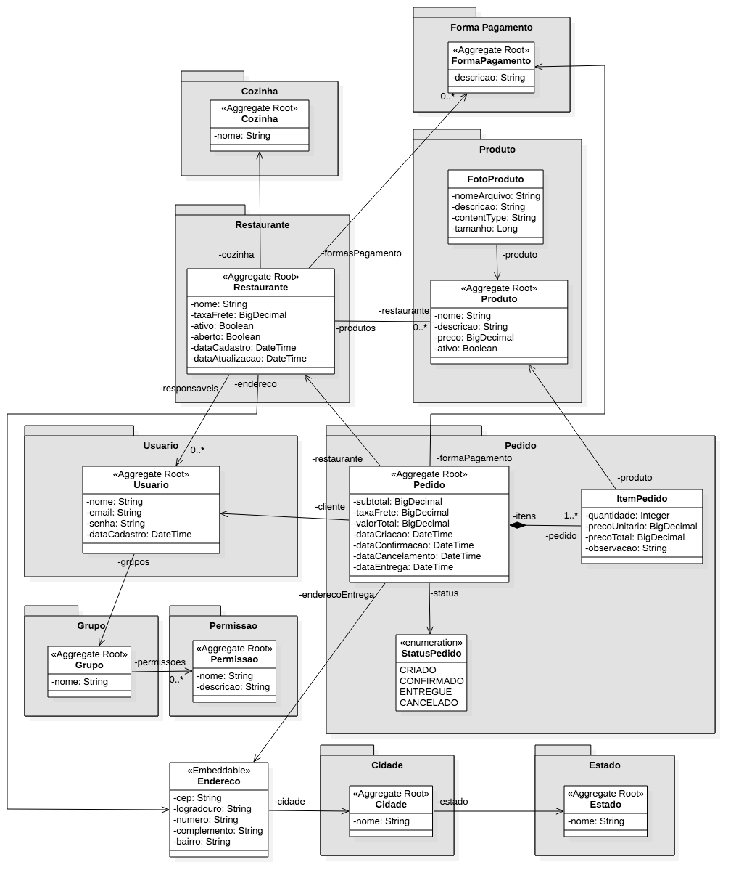

# vaptfood-API

Este projeto é uma API RESTful [Spring](http://projects.spring.io/spring-boot/) inspirada no sistema do iFood. Permite o gerenciamento de restaurantes, pedidos e usuários, facilitando a interação entre clientes e estabelecimentos.

## Diagrama de Entidades



## Softwares de Base

Para desenvolver a aplicação você irá precisar instalar na sua máquina:

*   [JDK 17](http://www.oracle.com/technetwork/java/javase/downloads/jdk8-downloads-2133151.html) - Java™ Platform, Standard Edition Development Kit 
*   [Maven 3](https://maven.apache.org) - Gerenciador de Dependências
* 	[Flyway](https://flywaydb.org/) - Controle de versão do banco de dados
* 	[Spring Boot 2.7.9](https://spring.io/projects/spring-boot) - Framework para facilitar o bootstrapping and desenvolvimento de novas aplicações Spring 
* 	[MySQL 8](https://www.mysql.com/) - Sistema de Gerenciamento de Banco de Dados Relacional Open-Source 
* 	[Git](https://git-scm.com/) - Sistema de Controle de Versão


## Ferramentas Externas Utilizadas

* [Postman*](https://www.getpostman.com/) - API Development Environment (Testing Documentation)
* [JasperSoft](https://www.jaspersoft.com/) - Embedded Analytics and Reporting Software (Geração de relatórios em pdf)
* [Thymeleaf](https://www.thymeleaf.org/) - Server-side Java template engine (Template dos e-mails)


*A pasta docs contém um arquivo com todas as requisições possíveis para a API. Bastando apenas importar e utilizar no postman.

## Rodando a Aplicação Localmente

Primeiro renomeie o arquivo `ApplicationExample.properties` em `vaptfood/src/main/resources/`  para `applicatioin.properties` e preencha-o com os dados necessários correspondentes às configurações da sua máquina. 

Há diversos caminhos para rodar uma aplicação com Spring Boot na sua máquina local. Um deles é executar o método `main` na classe `vaptfood/src/main/java/com/example/vaptfood` da sua IDE. Para tal sga os passos abaixo:
1. Faça o Download do zip do projeto ou clone o repositório Git
2. Extraia o conteúdo do zip
3. Abra o Command Prompt e navegue ($cd) até a pasta contendo o pom.xml
4. Abra o eclipse
5. Vá em: File -> Import -> Existing Maven Project -> Navegue até a pasta onde você extraiu o zip
6. Selecione o projeto
7. Choose the Spring Boot Application file (search for @SpringBootApplication)
8. Clique com o direito no arquivo e faça Run as Java Application

Uma alternativa é utilizar o [Spring Boot Maven plugin](https://docs.spring.io/spring-boot/docs/current/reference/html/build-tool-plugins-maven-plugin.html) com o comando:

```shell
    mvn spring-boot:run
```

### Segurança

No `pom.xml` podemos observar as dependências necessárias ao bom funcionamento dos requisitos de segurança adequados para o projeto:

```
<dependency>
    <groupId>org.springframework.boot</groupId>
    <artifactId>spring-boot-starter-security</artifactId>
    <version>2.2.2.RELEASE</version>
</dependency>
        
<dependency>
    <groupId>org.springframework.security.oauth</groupId>
    <artifactId>spring-security-oauth2</artifactId>
    <version>2.3.5.RELEASE</version>
</dependency>

<dependency>
    <groupId>org.springframework.security</groupId>
    <artifactId>spring-security-jwt</artifactId>
    <version>1.0.0.RELEASE</version>
</dependency>
```


### URLs

|  URL |  Método | Descrição |
|----------|--------------|--------------|

## Arquivos e Diretórios

O projeto tem uma estrutura de diretórios particular. Uma árvore representativa é mostrada a seguir:

```
.
├── vaptfood
├── src
│   └── main
│       └── java
|            └── com.anaclara.vaptfood
│                   ├── VaptFoodApplication.java

```

## Pacotes

- `config` — classes de configuração da aplicação
- `cors` — Cross-origin resource sharing/classes para lidar com as permissão/comportamento dos diferentes tipos de requisições e origens
- `dto` — Data Transfer Object/classes que lidam com a comunicação com o banco de dados
- `event` — classes para lidar com a escuta/disparo de comportamentos específicos no sistema
- `exceptionhandler` — classes para lidar com o tratamento de excesões
- `mail` — classes para lidar com o envio de e-mail
- `models` — classes para representar entidades modeladas
- `repository` — classes que lidam com a comunicação com o banco de dados
- `services` — classes para lidar com as regras de negócio
- `storage` — classes para lidar com o armazenamento/recuperação de arquivos junto ao serviço da amazon S3
- `security` — configurações de segurança da aplicação
- `resource` — classes para ouvir/direcionar as requisições doc cliente
- `resources/application.properties` — O Spring lê as propriedades definidas neste arquivo para configurar sua aplicação. Neste arquivo você pode definir a porta padrão do servidor, o context path do servidor, os URLs do banco de dados etc., neste arquivo
- `token` — classes para lidar com o fornecimento/verificação de tokens de segurança
- `pom.xml` - contém todas as dependências do projeto e suas respectivas configurações


Qualquer dúvida e/ou feedback escreva um e-mail para claracorreadasilva@gmail.com

#### Links Uteis

Padronização de mensagens de erro
https://datatracker.ietf.org/doc/html/rfc7807


Validações de campos
https://beanvalidation.org/
https://hibernate.org/validator/
https://docs.jboss.org/hibernate/stable/validator/reference/en-US/html_single/#section-builtin-constraints

Data e Hora em APIs
https://apiux.com/2013/03/20/5-laws-api-dates-and-times/